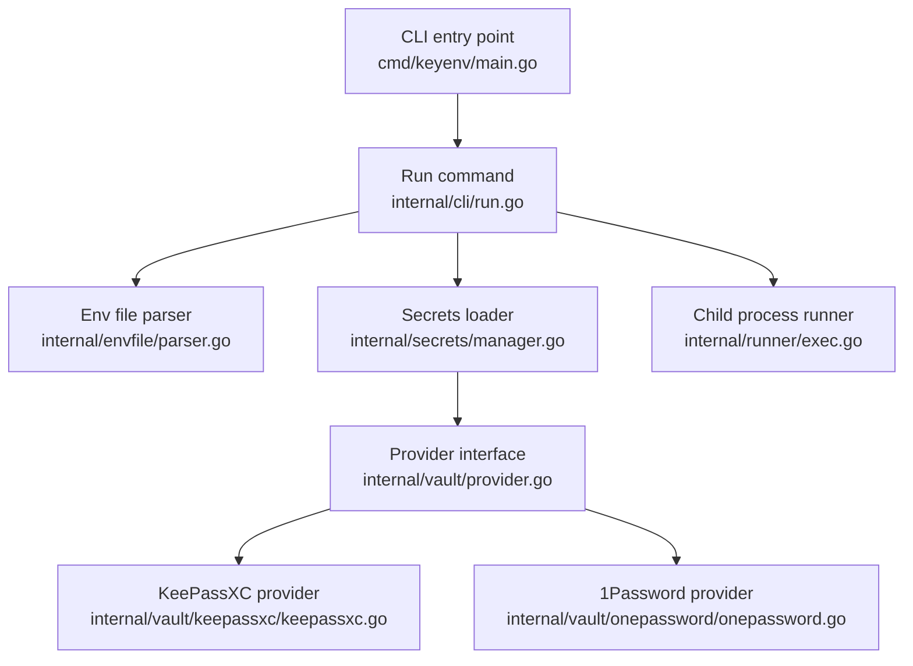

# key-env

**Keep secrets encrypted in your password manager -- not in your `.env` files.**

[](https://github.com/the-known-unknown/key-env/actions/workflows/ci.yml)
[](https://github.com/the-known-unknown/key-env/releases)

---

Your `.env` files today:

```env
CLIENT_SECRET="Jcg5TfdI9X0zHaU03Qx9bGb0rphYh0xIebtpFPTcRT"
CLIENT_NAME="test"
```

Your `.env` files with `key-env`:

```env
CLIENT_SECRET="kp://my-api/Password"
CLIENT_NAME="kp://my-api/Username"
```

The actual values stay encrypted in your password manager. `key-env` resolves them at runtime and passes them to your app. Nothing is written to disk in plaintext.

---

## The problem

`.env` files store API keys, database credentials, and OAuth secrets in plaintext. They get committed to repos, shared over Slack, and copied between machines. Every duplicate is another place a secret can leak.

Agentic coding tools make this worse. Copilot, Cursor, and Claude read and write code on your behalf -- which means they also read your `.env` files. Every AI agent that touches your project increases the surface area of exposure. The result: plaintext secrets scattered across machines, repos, and chat histories, accessible to tools and processes you don't fully control.

---

## How it works

When you run your application through `key-env`, it:

1. Reads your `.env` file and identifies secret references (e.g. `kp://...`)
2. Resolves each reference by querying your local password manager
3. Injects the decrypted values into the environment
4. Launches your application with the fully hydrated environment

Plain values are passed through as-is. You can mix secrets and non-secrets in the same `.env` file.

---

## Set up your local password manager

`key-env` resolves secrets through [KeePassXC](https://keepassxc.org/), a free, open-source, offline password manager. You'll need the `keepassxc-cli` command-line tool on your `PATH`.

**macOS:**

```sh
brew install keepassxc
```

**Linux:**

```sh
# Ubuntu / Debian
sudo apt install keepassxc

# Fedora
sudo dnf install keepassxc
```

You can also download installers directly from [keepassxc.org](https://keepassxc.org/).

Verify the CLI is available:

```sh
keepassxc-cli --version
```

> **Coming soon:** 1Password CLI (`op://`) support is on the roadmap. Stay tuned.

---

## Quick start

**1. Download and install the binary**

Grab the latest release for your platform from the [releases page](https://github.com/the-known-unknown/key-env/releases).

```sh
# Example for macOS Apple Silicon — adjust the URL for your platform
curl -LO https://github.com/the-known-unknown/key-env/releases/latest/download/key-env_darwin_arm64.tar.gz
tar xzf key-env_darwin_arm64.tar.gz
```

Move it somewhere on your `PATH`:

```sh
sudo mv key-env /usr/local/bin/
```

Or, if you prefer not to use `sudo`, drop it in a local bin directory:

```sh
mkdir -p ~/.local/bin
mv key-env ~/.local/bin/

# Add to your PATH if it isn't already (add this line to your ~/.zshrc or ~/.bashrc)
export PATH="$HOME/.local/bin:$PATH"
```

Verify it works:

```sh
key-env --version
```

**2. Try it with the included sample**

The repo includes a sample KeePassXC database and `.env` file so you can test immediately:

```sh
git clone https://github.com/the-known-unknown/key-env.git
cd key-env
```

```sh
key-env run \
  --env test/.env.sample \
  --secrets test/keepass-sample-db.kdbx \
  --password '4jFU%i*+Q2qdpFgoHJGK' \
  -- sh -c 'echo $TEST_CLIENT_SECRET'
```

```
Jcg5TfdI9X0zHaU03Qx9bGb0rphYh0xIebtpFPTcRT
```

The secret was resolved from the encrypted KeePassXC database and injected into the shell command.

---

## Examples

The `test/` directory includes sample scripts that print the resolved secrets and run a progress bar.

**Shell:**

```sh
key-env run \
  --env test/.env.sample \
  --secrets test/keepass-sample-db.kdbx \
  --password '4jFU%i*+Q2qdpFgoHJGK' \
  -- sh -c 'echo "CLIENT_SECRET=$TEST_CLIENT_SECRET"; echo "CLIENT_NAME=$TEST_CLIENT_NAME"'
```

```
CLIENT_SECRET=Jcg5TfdI9X0zHaU03Qx9bGb0rphYh0xIebtpFPTcRT
CLIENT_NAME=test
```

**Python:**

```sh
key-env run \
  --env test/.env.sample \
  --secrets test/keepass-sample-db.kdbx \
  --password '4jFU%i*+Q2qdpFgoHJGK' \
  -- python3 test/sample.py
```

```
Starting Python sample...
Env vars:
TEST_CLIENT_SECRET: Jcg5TfdI9X0zHaU03Qx9bGb0rphYh0xIebtpFPTcRT
TEST_CLIENT_NAME: test

Doing some work...
[██████████] 100%
✔ Done!
```

**Node.js:**

```sh
key-env run \
  --env test/.env.sample \
  --secrets test/keepass-sample-db.kdbx \
  --password '4jFU%i*+Q2qdpFgoHJGK' \
  -- node test/sample.js
```

```
Staring Node.js sample...
Env vars:
TEST_CLIENT_SECRET: Jcg5TfdI9X0zHaU03Qx9bGb0rphYh0xIebtpFPTcRT
TEST_CLIENT_NAME: test
NODE_ENV:

Doing some work...
[██████████] 100%
✔ Node.js sample done!
```

**Node.js with inline env vars:**

`key-env` exec's the child command directly, not through a shell, so the `VAR=value command` syntax won't work after `--`. Use `env` as a wrapper:

```sh
key-env run \
  --env test/.env.sample \
  --secrets test/keepass-sample-db.kdbx \
  --password '4jFU%i*+Q2qdpFgoHJGK' \
  -- env NODE_ENV=development node test/sample.js
```

```
Staring Node.js sample...
Env vars:
TEST_CLIENT_SECRET: Jcg5TfdI9X0zHaU03Qx9bGb0rphYh0xIebtpFPTcRT
TEST_CLIENT_NAME: test
NODE_ENV: development

Doing some work...
[██████████] 100%
✔ Node.js sample done!
```

---

## Install

**GitHub Releases:**

Download the latest binary for your platform from the [releases page](https://github.com/the-known-unknown/key-env/releases). Binaries are available for macOS (amd64, arm64) and Linux (amd64, arm64).

**Homebrew (macOS/Linux):**

```sh
brew install the-known-unknown/tap/key-env
```

---

## Build from source

Requires Go 1.22+.

```sh
git clone https://github.com/the-known-unknown/key-env.git
cd key-env
make build
```

This runs the test suite and produces a `key-env` binary in the project root.

---

## Usage

### `.env` file format

Plain values work as-is:

```env
DB_NAME="userdb"
APP_PORT="3000"
```

Secret references use the `kp://` prefix to point into your KeePassXC database:

```env
DB_PASSWORD="kp://Services/Databases/Main/Password"
API_KEY="kp://Services/Stripe/SecretKey"
```

The format is `kp://<entry_path>/<credential>`, where:

- `entry_path` is the path to the entry in your KeePassXC database (e.g. `Services/Databases/Main`)
- `credential` is the field to retrieve (e.g. `Password`, `Username`)

### Command

```sh
key-env run \
  --env <path-to-env-file> \
  --secrets <path-to-kdbx-file> \
  --password '<vault-password>' \
  -- <your command>
```

| Flag         | Required | Description                               |
| ------------ | -------- | ----------------------------------------- |
| `--env`      | Yes      | Path to your `.env` file                  |
| `--secrets`  | Yes      | Path to your `.kdbx` KeePassXC database   |
| `--password` | Yes      | Password to unlock the KeePassXC database |
| `--verbose`  | No       | Print per-variable logs and summary stats |
| `--version`  | No       | Print version and exit                    |
| `--help`     | No       | Show help message                         |
| `--`         | Yes      | Separator before the child command        |

### Verbose mode

Pass `--verbose` to see which variables were decrypted and a summary of what was loaded:

```sh
key-env run \
  --verbose \
  --env test/.env.sample \
  --secrets test/keepass-sample-db.kdbx \
  --password '4jFU%i*+Q2qdpFgoHJGK' \
  -- sh -c 'echo $TEST_CLIENT_SECRET'
```

```
[key-env | kp]: ✔ TEST_CLIENT_SECRET
[key-env | kp]: ✔ TEST_CLIENT_NAME

Loaded 2 env vars (2 decrypted)
  kp:// 100.0%
  op://   0.0%

--- key-env complete ---
Jcg5TfdI9X0zHaU03Qx9bGb0rphYh0xIebtpFPTcRT
```

---

## Supported vaults

| Prefix  | Provider      | Status      |
| ------- | ------------- | ----------- |
| `kp://` | KeePassXC     | Implemented |
| `op://` | 1Password CLI | Planned     |

See [Set up your local password manager](#set-up-your-local-password-manager) for install instructions. Tested with KeePassXC 2.7.11.

---

## Security notes

- The `--password` flag can expose your vault password in shell history and process listings. In production workflows, prefer passing it via stdin or a secure file.
- Your `.env` file still reveals metadata -- variable names and vault paths -- even though the actual secret values are encrypted. Be mindful when sharing or committing it.
- The decrypted secrets exist in the child process's environment for the duration of its execution. They are not written to disk.

---

## Development

Run tests:

```sh
go test ./...
```

Build:

```sh
make build
```

Clean:

```sh
make clean
```

---

## Architecture



**`cmd/keyenv/main.go`** -- Entry point. Parses top-level flags (`--version`, `--help`) and delegates to the `run` command.

**`internal/cli/run.go`** -- Orchestrates the entire flow: parses `run` flags, calls the env parser, wires up vault providers, runs the secrets loader, merges the resolved environment, and exec's the child process. Also prints the `--verbose` summary.

**`internal/envfile/parser.go`** -- Reads a `.env` file line by line and classifies each variable as `plain`, `kp` (KeePassXC), or `op` (1Password) based on its value prefix. Returns a slice of `ParsedVar` structs.

**`internal/secrets/manager.go`** -- Takes the parsed variables and resolves any secret references by dispatching to the appropriate vault provider. Plain values pass through unchanged. Also provides `MergeWithCurrentEnv` to layer the resolved vars on top of the current process environment.

**`internal/vault/provider.go`** -- Defines the `Provider` interface: a single `Resolve(path string) (string, error)` method. All vault backends implement this interface.

**`internal/vault/keepassxc/keepassxc.go`** -- KeePassXC implementation of `Provider`. Parses the `kp://` path into an entry path and credential name, then shells out to `keepassxc-cli show` to retrieve the value.

**`internal/vault/onepassword/onepassword.go`** -- 1Password placeholder. Currently returns an error indicating `op://` support is not yet available.

**`internal/runner/exec.go`** -- Exec's the child command with the fully resolved environment. Wires stdin/stdout/stderr through to the child process.

---

## Releasing

Releases are automated via [GoReleaser](https://goreleaser.com/) and GitHub Actions.

```sh
make release VERSION=0.2.0
```

This tags the commit and pushes the tag. GitHub Actions builds binaries for macOS and Linux, creates a GitHub Release, and updates the Homebrew tap formula.

All releases are listed on the [releases page](https://github.com/the-known-unknown/key-env/releases).
